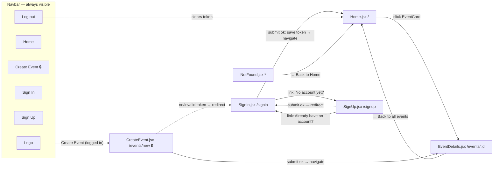
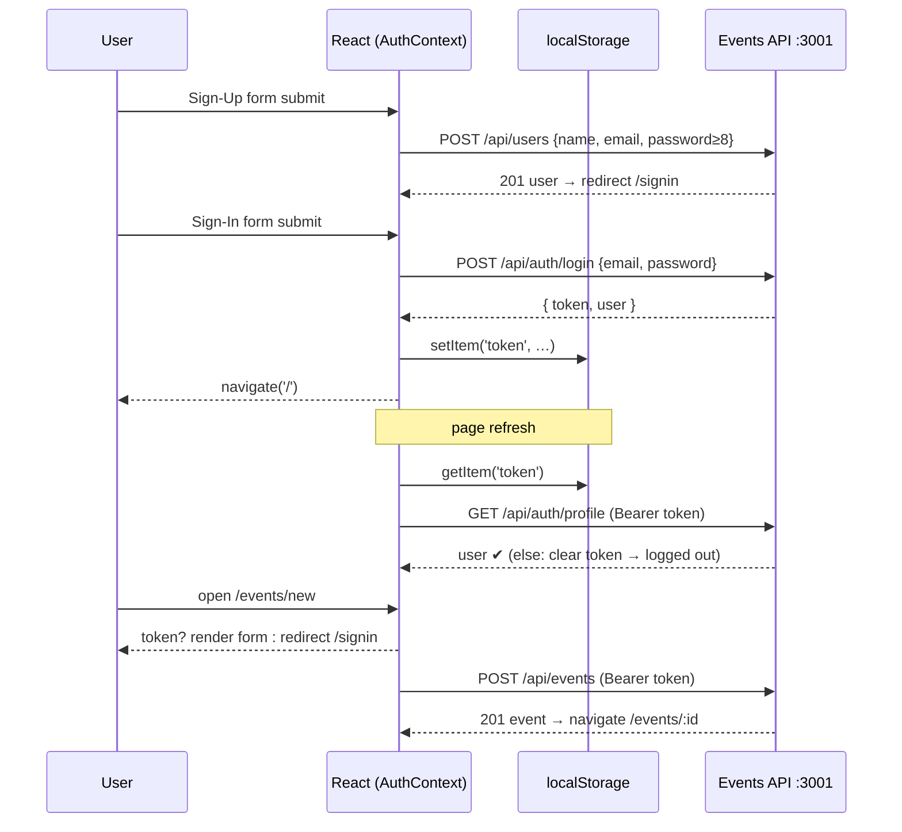
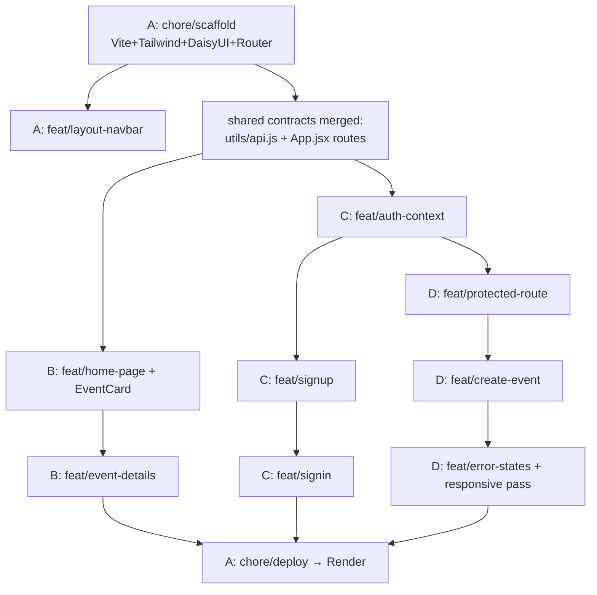

# 📋 Events App — Planning Document

> Group project · WBS Coding School · React + Vite + Tailwind/DaisyUI + React Router + Events API
> Put this file in the repo root as `PLANNING.md` — Mermaid diagrams render directly on GitHub.

---

## 1. Routes / Pages

| Route | File | Access | Purpose | API call |
|---|---|---|---|---|
| `/` | `pages/Home.jsx` | public | Event list as cards, sorted chronologically | `GET /api/events?limit=50` |
| `/events/:id` | `pages/EventDetails.jsx` | public | Full details of one event | `GET /api/events/:id` |
| `/events/new` | `pages/CreateEvent.jsx` | 🔒 **protected** | Form to create an event | `POST /api/events` (+ Bearer token) |
| `/signup` | `pages/SignUp.jsx` | public | Registration form → redirect to `/signin` | `POST /api/users` |
| `/signin` | `pages/SignIn.jsx` | public | Login form → store token → redirect to `/` | `POST /api/auth/login` |
| `*` | `pages/NotFound.jsx` | public | 404 fallback | — |

> Scope note: the API also offers `GET /api/users` etc., but no user-list page is required — we deliberately keep it out of scope (stretch goal only if everything else is done).

## 2. Component tree (who renders whom)

```
main.jsx
└── <BrowserRouter>
    └── <AuthProvider>                    ← token + user state for the whole app
        └── App.jsx (Routes only)
            └── MainLayout.jsx            ← always: Navbar + <Outlet/> + Footer
                ├── Navbar.jsx            ← links change with auth state
                ├── Home.jsx
                │   └── EventCard.jsx  ×N ← whole card is a <Link>
                ├── EventDetails.jsx
                ├── SignUp.jsx
                ├── SignIn.jsx
                ├── ProtectedLayout.jsx   ← guard: no token → <Navigate to="/signin"/>
                │   └── CreateEvent.jsx
                └── NotFound.jsx
```

Shared modules (not components): `utils/api.js` (all fetches + token header + error parsing), `context/AuthContext.jsx` (login/logout, localStorage, token validation).

## 3. Click flow — what click leads where



## 4. Auth flow (the part instructors ask about)



## 5. Page wireframes (rough — final look via DaisyUI)

```
┌────────────────────────────────────────────┐  Home  /
│ 🎫 Events App      Home  Sign In [Sign Up] │  ← Navbar (DaisyUI navbar)
├────────────────────────────────────────────┤
│  Upcoming Events                           │
│  ┌─────────┐ ┌─────────┐ ┌─────────┐      │  grid: 1 col mobile /
│  │ Title   │ │ Title   │ │ Title   │      │  2 cols sm / 3 cols lg
│  │ 📅 date │ │ 📅 date │ │ 📅 date │      │
│  │ 📍 loc  │ │ 📍 loc  │ │ 📍 loc  │      │  whole card clickable
│  │ [Details]│ │[Details]│ │[Details]│      │  → /events/:id
│  └─────────┘ └─────────┘ └─────────┘      │
└────────────────────────────────────────────┘

┌────────────────────────────────────────────┐  EventDetails  /events/:id
│ ← Back to all events                       │
│ ┌────────────────────────────────────────┐ │
│ │ Title (h1)                             │ │
│ │ 📅 full date · 📍 location             │ │
│ │ ────────────────────────────────────── │ │
│ │ description …                          │ │
│ │ View on map ↗                          │ │
│ └────────────────────────────────────────┘ │
└────────────────────────────────────────────┘

┌──────────────────────┐   ┌──────────────────────┐   ┌──────────────────────┐
│ Sign Up   /signup    │   │ Sign In   /signin    │   │ Create Event 🔒      │
│ [name    ]           │   │ [email   ]           │   │ [title   ]           │
│ [email   ]           │   │ [password]           │   │ [description ▭▭]     │
│ [password] (≥8!)     │   │ (alert on error)     │   │ [datetime-local]     │
│ [confirm ]           │   │ (Sign in)            │   │ [location]           │
│ (Create account)     │   │ link → /signup       │   │ [lat] [lon]          │
│ link → /signin       │   └──────────────────────┘   │ (Create event)       │
└──────────────────────┘                              └──────────────────────┘
```

## 6. State plan — where does which state live?

| State | Lives in | Why |
|---|---|---|
| `token`, `user`, `loading` | `AuthContext` (+ token mirrored in `localStorage`) | Needed by Navbar, ProtectedLayout, SignIn, CreateEvent → context instead of prop-drilling |
| `events`, `loading`, `error` | `Home.jsx` | Only Home needs the list |
| `event`, `loading`, `error` | `EventDetails.jsx` | Local to the page, keyed by `useParams().id` |
| form fields (all forms) | each page, one `useState` object | Controlled inputs, single `handleChange` via `name` attr |
| `submitting`, `error` per form | each form page | Button spinner + DaisyUI alert (FR019) |

## 7. Task split & build order



Rule: **one person per file**; only `App.jsx` and `utils/api.js` are shared — they get merged first and then frozen (changes only by team agreement in stand-up).

## 8. Definition of Done (per page)

- [ ] Loading state (spinner), error state (alert with API message), empty state where relevant
- [ ] Works at mobile width (DevTools 375px) and desktop
- [ ] No direct `fetch` in components — everything through `utils/api.js`
- [ ] Merged into `main` via reviewed PR, demoed in stand-up
